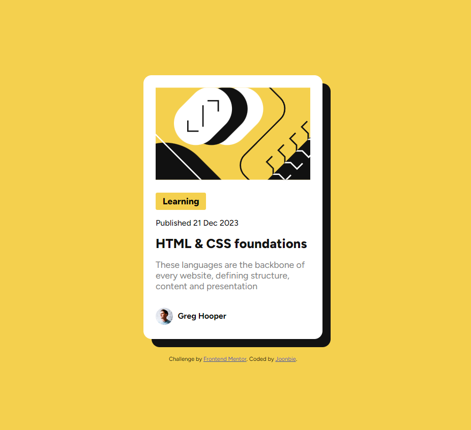
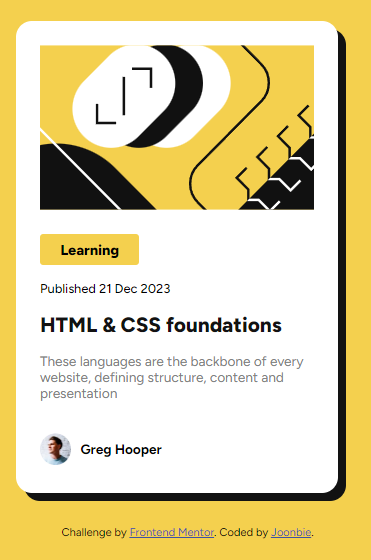

# Frontend Mentor - Blog preview card solution

This is a solution to the [Blog preview card challenge on Frontend Mentor](https://www.frontendmentor.io/challenges/blog-preview-card-ckPaj01IcS). Frontend Mentor challenges help you improve your coding skills by building realistic projects.

## Table of contents

- [Overview](#overview)
  - [The challenge](#the-challenge)
  - [Screenshot](#screenshot)
  - [Links](#links)
- [My process](#my-process)
  - [Built with](#built-with)
  - [What I learned](#what-i-learned)
  - [Useful resources](#useful-resources)
- [Author](#author)

**Note: Delete this note and update the table of contents based on what sections you keep.**

## Overview

### The challenge

Users should be able to:

- See hover and focus states for all interactive elements on the page

### Screenshot

Desktop View and Mobile View



### Links

- Solution URL: [Github Link](https://github.com/Joonbie/Blog-card-preview)
- Live Site URL: [Github Pages](https://joonbie.github.io/Blog-card-preview/)

## My process

### Built with

- Semantic HTML5 markup
- CSS custom properties
- Flexbox

### What I learned

First time to work with hover effects for anchor tags. It took some time to get it to work. But eventually got it to work!

```html
<div class="main-header">
  <a href="#"><p>HTML & CSS foundations</p></a>
</div>
```

```css
.main-header p:hover,
.main-header p:focus {
  color: var(--bg-yellow);
}
```

### Useful resources

- [box-shadow documentation](https://developer.mozilla.org/en-US/docs/Web/CSS/box-shadow) - This helped me for styling the box shadow for the card

## Author

- Website - [Joonbie](https://github.com/Joonbie)
- Frontend Mentor - [@Joonbie](https://www.frontendmentor.io/profile/Joonbie)
